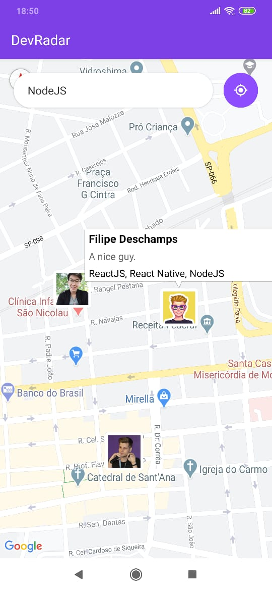
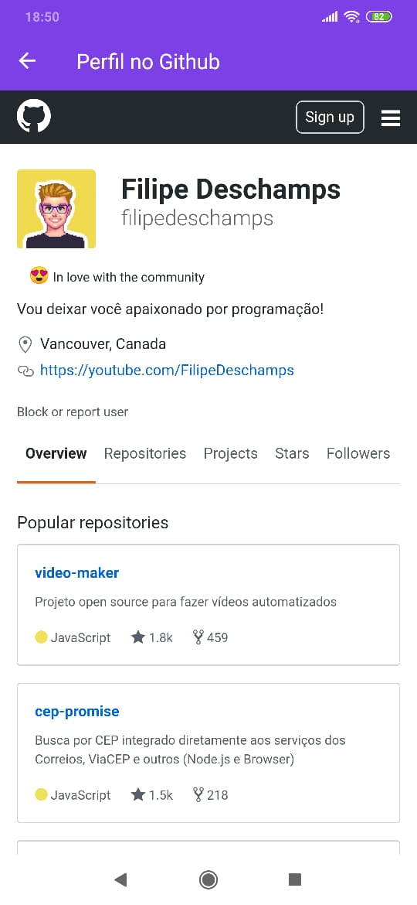
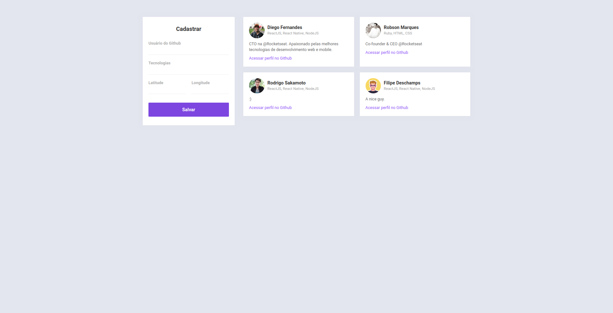

<h1 align="center">
  
</h1>

<h3 align="center">
Semana OmniStack 10.0 🚀 
</h3>

<h3>
O DevRadar é um projeto que visa conectar desenvolvedores próximos a você que trabalham com as mesmas tecnologias.
</h3>

<p align="center">
  
  
</p>

<p align="center">
  
</p>


## 🚀 Tecnologias

Esse projeto foi desenvolvido com as seguintes tecnologias:

- [Node.js](https://nodejs.org/en/)
- [React](https://reactjs.org/)
- [React Native](https://reactnative.dev/)
- [Expo](https://expo.io/)

## 💾 Instalação

<h3> Instalação - Backend</h3>
<p>Configure o MongoDB e atualize a string de conexão com seu User:Senha no arquivo index.js.</p>

```bash
# Clone o repositório
$ git clone https://github.com/rodrigosakamoto/devRadar.git

# em seguida execute:

$ cd devRadar
$ cd backend
$ yarn
$ yarn dev
```

<h3>Instalação - Frontend</h3>
<p>Para iniciar o Frontend do React utilize os comandos:</p>

```bash
$ cd devRadar
$ cd web
$ yarn
$ yarn start
```

<h3>Instalação - Mobile</h3>
<p>Para testar o Mobile do React Native, primeiro coloque o endereço do seu servidor (ou computador) no arquivo src/services/api.js, e depois execute os comandos:</p>

```bash
$ cd devRadar
$ cd mobile
$ yarn
$ yarn start
```
<p>Assim que o processo terminar, automaticamente será aberta no seu navegador a página localhost:19002. Conecte seu emulador, ou teste o aplicativo por LAN: baixe o aplicativo Expo da Play Store ou App Store e em seguida escaneie o código QR.</p>

---
By [Rodrigo Sakamoto](https://www.linkedin.com/in/rodrigo-sakamoto/)
